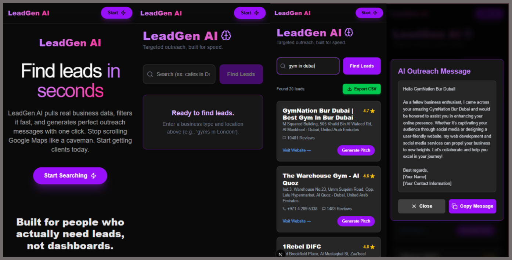

# **LeadGen AI**

LeadGen AI is a lightweight, fast lead-generation tool built with Next.js, Groq AI, and SerpAPI.
You type something like “cafes in Dubai” → it pulls real business results → and one click generates a personalized outreach message for each lead.

It’s built for freelancers, agencies, and anyone tired of scrolling Google Maps manually.Built with **Next.js**, **Groq**, and **SerpAPI**.

---

## **✨ Features**

* **Search Any Business**
  e.g. “cafes in Dubai”, “gyms in London”, “salons in Toronto”.

* **AI Outreach Messages**
  One click generates a personalized pitch for each lead.

* **Export to CSV**
  Download leads for email campaigns or CRM import.

* **Automatic Fallback Mode**
  When the real-time API can’t return results, the app loads a **random cached dataset** so the UI never breaks.

---

## **⚠️ Important Note About Missing Results**

If the search returns no live data and you see a warning:

> *“We hit the API limit. Showing cached results.”*

That means **the free SerpAPI monthly quota is finished**, not that the app is broken.
Cached data will be used until the quota resets.

---
## Overview
### Desktop  

### Mobile  

## **🛠️ Tech Stack**

* Next.js 15
* React
* TailwindCSS
* Groq (allam-2-7b model)
* SerpAPI
* LocalStorage caching
* JSON file fallback

## License

For personal use and learning. Not intended for heavy commercial scraping.
